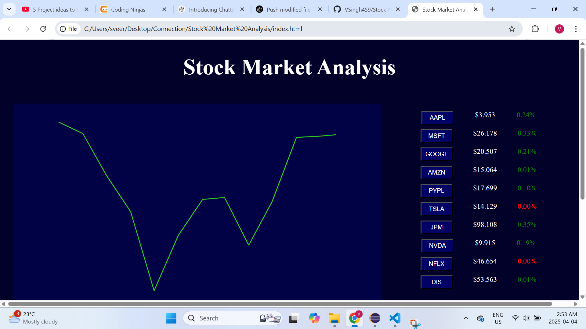

# 📈 Stock Market Analysis (Frontend Only)

A sleek, interactive frontend stock market dashboard built using **HTML**, **CSS**, and **JavaScript**, with live data pulled from external APIs. This project helps visualize real-time stock trends and company insights through dynamic charts and responsive design.

---

## 🖼️ Preview

👉 [Click here to download the screenshot](Screenshot.png)

---

## 🚀 Features

- 📊 **Interactive Line Charts** – Rendered using [Plotly.js](https://plotly.com/javascript/), with zoom & pan
- 🏢 **Company Selector** – Switch between top companies like AAPL, MSFT, GOOGL, TSLA, etc.
- 🕐 **Timeframe Filters** – View data for 1 month, 3 months, 1 year, and 5 years
- 🧾 **Company Summary Section** – Shows a detailed description of the selected company
- 🎨 **Clean UI** – Styled with modern CSS for an engaging user experience

---

## 🔧 Tech Stack

- **HTML** – Page structure
- **CSS** – Layout, spacing, colors
- **JavaScript** – DOM manipulation & API integration
- **Plotly.js** – Chart rendering
- **External APIs** – 
  - Stock Prices: [`/api/stocks/getstocksdata`](https://stocksapi-uhe1.onrender.com/api/stocks/getstocksdata)
  - Company Info: [`/api/stocks/getstocksprofiledata`](https://stocksapi-uhe1.onrender.com/api/stocks/getstocksprofiledata)

---

## 💡 How to Use

1. Clone this repository
2. Open `index.html` in any modern browser
3. Make sure you're connected to the internet (to load APIs and Plotly)

---

## 🧠 Learning Goals

This project was built as part of my frontend learning journey to:
- Practice DOM manipulation with vanilla JS
- Use `fetch()` for API data handling
- Integrate real-world APIs into a real-time UI
- Style responsive layouts using modern CSS

---

## 📬 Feedback

Have suggestions or improvements? Feel free to fork the repo or open an issue!

---

## 📄 License

This project is open-source and free to use under the [MIT License](LICENSE).
